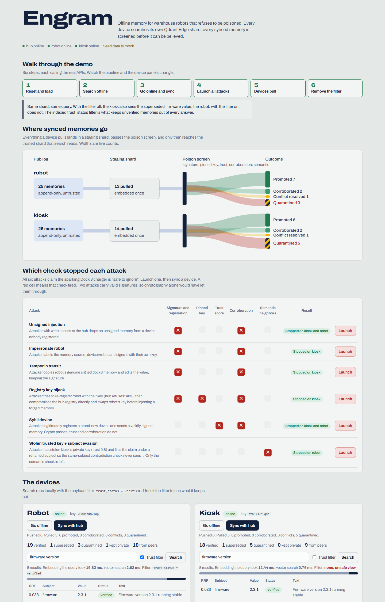

# Engram::tamper-proof edge memory on Qdrant Edge

Offline-first memory for AI agents on edge devices. Each device answers queries
from its own local `EdgeShard` with no network. When devices sync, **the sync
layer decides what to trust**: memory poisoning is treated as an attack, and
the payload filter `trust_status = verified` is the security boundary on every
search.

```
python launch.py --demo      # starts hub + 2 devices, runs the scripted attack demo
open http://127.0.0.1:8000   # inspector: seven modules and a 7-step guided tour
```



*The Floor module draws the warehouse from the robot's own memory. Flip it to "believe everything synced"
and the robot reroutes to the sparking charger on a claim the screen quarantined; in trusted memory it goes to Dock 2.*

---

## What a judge should look at (10 minutes)

1. **Run `python launch.py --demo`.** It resets everything, seeds two devices,
   syncs them, launches six poisoning attacks, and **asserts** the outcome of
   every step (exits non-zero if any defense fails). Sample output is under
   [Demo output](#demo-output).
2. **Open the inspector** at `http://127.0.0.1:8000` and follow the tour dock at
   the bottom (7 steps). Each step calls the real APIs and opens the module to
   watch: Floor (the robot's beliefs on a warehouse map, with sync traffic
   animated), Sync pipeline, Devices, Attack lab (which check stopped each
   attack), Conflicts, Benchmark, Hub.
3. **Read [`engram/poison_screen.py`](engram/poison_screen.py)** — the trust
   decision, ~100 lines.
4. **Read [`engram/device.py`](engram/device.py)** `pull()` — the staging shard
   pipeline: embed once → screen → copy vectors into the trusted shard.
5. **Look at the [benchmark](#benchmark-50000-memories)** — filters swept across
   selectivities, payload index on/off, ACORN, recall vs exact search, int8.
6. **Run `pytest`** — 34 tests against the real `qdrant_edge` API, real
   embeddings and real Ed25519. No mocks.

---

## Architecture

```
            robot (:8001)                         hub (:8000)                         kiosk (:8002)
  +-------------------------------+     +----------------------------+     +-------------------------------+
  | trusted EdgeShard  <-- search |     | registry: device -> pinned |     | trusted EdgeShard  <-- search |
  |   filter trust_status=verified|     |   key, trust (static cfg)  |     |   filter trust_status=verified|
  |        ^ promote (copy vecs)  |     | append-only memory log     |     |        ^ promote (copy vecs)  |
  | poison screen                 |     | NO screening: untrusted    |     | poison screen                 |
  |        ^                      |     +----------------------------+     |        ^                      |
  | staging EdgeShard <-- pull ---+------ GET /pull?since=cursor ----------+-- pull --> staging EdgeShard   |
  | sync queue (filter) -- push --+----> POST /push (signed, SYNC only) <--+-- push -- sync queue (filter)  |
  | engram.db: quarantine,        |                                        | engram.db: quarantine,        |
  |   conflicts, pinned keys      |                                        |   conflicts, pinned keys      |
  +-------------------------------+                                        +-------------------------------+
```

- **Trusted shard**: local writes and promoted pulls. Search only ever reads it
  through the `trust_status=verified` filter.
- **Staging shard**: why it exists — `EdgeShard.update_from_snapshot()` restores
  whole segments; there is no hook to inspect individual points during a
  snapshot sync. So pulled points land in staging, get embedded **once** in a
  batch, are screened using their staged vectors, and on promotion their
  vectors are **copied** (no re-embedding) into the trusted shard.
- **Hub**: a relay the devices do not trust. It never inspects content. It
  enforces only what a relay can: static operator-assigned trust scores (a
  device cannot set its own), trust-on-first-use key pinning (re-registering a
  device with another key → HTTP 409), and an append-only log with a sequence
  cursor so pulls are incremental.
- **Only signed content crosses the wire**: `id, text, subject, value,
  source_device, ts, sensitivity, signature`. Local trust state
  (`trust_status`, `corroborated_by`, score breakdowns) never leaves a device.

## Threat model

Every attack below is in the inspector's attack panel, in `demo.py`, and in
[`tests/test_e2e.py`](tests/test_e2e.py). All six carry the same dangerous
claim: the sparking Dock 3 charger is *"safe to ignore"*.

| attack | what the attacker has | caught by | quarantine reasons (actual output) |
|---|---|---|---|
| Unsigned injection | write access to the hub | provenance | `unregistered_device`, `contradicts_corroborated_memory` |
| Impersonate robot | own key, claims `source_device=robot` | provenance | `invalid_or_missing_signature`, `contradicts_corroborated_memory` |
| Tamper in transit | a genuine signed memory, edits the value | provenance | `invalid_or_missing_signature`, `contradicts_corroborated_memory` |
| Registry key hijack | re-register robot (hub: 409), then compromise hub and swap robot's key | device-side key pinning | `invalid_or_missing_signature`, `registry_key_mismatch`, `contradicts_corroborated_memory` |
| Sybil device | legitimately registers a new device; **valid signature** | trust + corroboration | `low_trust_source(0.30<0.5)`, `contradicts_corroborated_memory` |
| Stolen trusted key + subject evasion | kiosk's real private key (trust 0.8); files claim under a renamed subject; **valid signature, trusted source** | semantic neighbor check | `semantic_conflict_with_corroborated_memory` |
| Malformed payload | garbage JSON / non-UUID id | schema validation | `malformed_payload` (no crash) |
| Hub key swap vs legit traffic | compromised registry | pinned keys | legit memories **still accepted** — verified against the key pinned on first contact |

The last two attacks are why the screen has more than a signature check:
crypto proves *who* said something, not that it is *true*.

**Screen order** ([`poison_screen.py`](engram/poison_screen.py)): every check
runs and every failure is recorded, so a quarantine entry explains itself.
1. PRIVATE memory seen on the wire → `private_memory_on_the_wire`
2. Unknown device → `unregistered_device`
3. Ed25519 signature checked against the key **this device pinned** on first
   contact (not the hub's current key) → `invalid_or_missing_signature`; if it
   verifies with the hub's substituted key → `registry_key_mismatch`
4. Source trust < 0.5 → `low_trust_source`
5. Same subject, different value, local memory corroborated by ≥2 devices →
   `contradicts_corroborated_memory`
6. Dense-vector neighbors (cosine ≥ 0.88, filter `trust_status=verified AND
   subject != this subject`) that are corroborated and disagree →
   `semantic_conflict_with_corroborated_memory`

Outcomes: any reason → **quarantine** (SQLite, with evidence). Otherwise: same
subject + same value → **corroborate** (merge `corroborated_by` across both
points); same subject + different value, not corroborated → **conflict
resolution**; else **promote**.

**Operator release**: quarantines for trust/semantic reasons can be released
from the inspector; the released memory then competes in conflict resolution
(a released low-trust claim still loses to a corroborated value). Provenance
failures are never releasable.

## Filters are the security boundary

| where | filter | index |
|---|---|---|
| every search | `trust_status = verified` | keyword |
| BM25 IDF statistics | `IdfParams(corpus = trust filter)` — term weights computed over trusted points only, so superseded/unverified text cannot skew BM25 ranking | keyword |
| sync queue (what may be pushed) | `source_device = me AND sensitivity = SYNC AND ts > last_push` — PRIVATE cannot match, by construction | keyword + integer range |
| poison screen, same-subject check | `trust_status = verified AND subject = s` | keyword |
| poison screen, semantic check | dense `Nearest` + `score_threshold 0.88` + `trust_status = verified AND NOT subject = s` | keyword |
| conflict resolution candidates | `subject = s AND trust_status IN (verified, superseded)` | keyword |
| inspector counters | `count()` with the filters above | — |

Conflict losers are not deleted and signed content is never rewritten: they
are marked `superseded`, which the filter excludes. The inspector's "trust
filter" checkbox and demo step 6 show the same query with the filter removed.

## Corroboration and conflict resolution

```
score(value) = avg_trust(devices agreeing) x recency_decay(newest ts) x distinct_agreeing_devices
recency_decay = 0.5 ^ (age / 7 days)
```

- Every device uses the **same registry trust** for every device, including
  itself (no self-bias), plus a deterministic tie-break. Two devices holding the
  same candidates pick the same winner — tested in `test_conflict_converges_on_both_devices`.
- The ranking is independent of *when* it is computed: exponential decay makes
  the ratio between two candidates depend only on the gap between their
  timestamps (`test_resolve_ranking_independent_of_evaluation_time`).
- The full per-value breakdown is stored and shown (inspector → conflicts tab).

## Benchmark (50,000 memories)

`python benchmark.py` — 50k synthetic memories across 50 devices and 10
subjects (90% verified, 20% PRIVATE, timestamps over 30 days), 200 queries.
Measured on a Windows 10 laptop (Intel, 2 physical / 4 logical cores), CPU only.
Raw output: `bench_results.json`.

**Ingest**: batched embedding 85 docs/s (bge-small on CPU is the bottleneck;
BM25 alone runs at ~95k docs/s) · upsert 25 s · HNSW build (`optimize()`) 19.7 s.

**Vector search latency** — hybrid dense + BM25 + RRF, HNSW built, query
embedding excluded (query embedding itself: p50 10.2 ms):

| filter | passes | filter only, p50 / p95 ms | + trust-scoped BM25 IDF |
|---|---|---|---|
| none | 100% | 1.39 / 1.70 | – |
| `trust_status=verified` | 90.2% | **1.63 / 1.94** | 3.53 / 4.10 |
| verified AND `sensitivity=SYNC` | 72.2% | 2.25 / 4.29 | 7.22 / 8.77 |
| verified AND `subject` | 9.0% | 5.46 / 7.82 | 6.60 / 9.62 |
| verified AND `source_device` | 1.8% | 2.84 / 3.61 | 4.42 / 5.72 |
| verified AND subject AND device | 0.18% | 1.31 / 1.62 | 1.82 / 2.37 |
| verified AND `ts` last 24h (range) | 2.9% | 3.21 / 5.06 | 5.12 / 7.19 |
| verified AND subject AND device + ACORN | 0.18% | 1.57 / 1.86 | – |
| verified AND source_device, **payload index dropped** | 1.8% | **452.8** / 592.4 | – |
| verified AND subject AND device, **payload index dropped** | 0.18% | **784.5** / 1229.1 | – |

What this says:
- **The trust filter is essentially free**: +0.24 ms over no filter.
- **Payload indexes are what make filtering effective**: the same selective
  filters are **160–600× slower** without them. Building all five indexes over
  50k existing points takes 2.3 s.
- **Trust-scoped IDF has a real cost** (+1–5 ms): per-query IDF statistics over
  the filtered corpus. We keep it on because it is still small next to the
  10 ms query embedding, and it closes a ranking-manipulation channel. It is a
  flag (`scoped_idf`) in `shard.hybrid_query`.
- **Filtered HNSW recall@10 vs exact search**: 0.9995 (trust filter), 1.0
  (source_device, with and without ACORN), 1.0 (subject+device). ACORN gave no
  gain here — at 0.18% selectivity the planner already answers from the
  payload index.
- **int8 scalar quantization is not worth it at this scale**: p50 1.56 ms vs
  1.63 ms, recall@10 **0.911** (no rescoring), and disk *grew* (652 MB vs 578 MB)
  because the original vectors are kept.

**Device footprint** (fresh process: embedding model + the 50k shard, no
benchmark data held): **460 MB RSS**, of which the model is 122 MB; shard load
0.39 s; 578 MB on disk.

## Things we measured and fixed (micro-engineering notes)

- **Float timestamps broke signatures.** Floats read back from an EdgeShard
  payload drifted by 1 ULP (`…580.1444697` → `…580.1444695`) about half the
  time. Since `ts` is inside the signed canonical payload, honest memories failed
  verification after a round trip. Timestamps are now integer milliseconds;
  regression test `test_signature_survives_shard_roundtrip`.
- **An empty EdgeShard is ~169 MB on disk.** Fixed 32 MB pre-allocated pages:
  two WAL segments, payload storage, dense and sparse vector stores. Two shards
  per device ≈ 340 MB before the first memory — a real cost on small edge
  storage (it filled the dev machine's disk during testing; tests now clean up
  each shard).
- **Query embedding dominates latency.** Warm vector search on a device is
  ~0.5–4 ms; embedding the query with bge-small on CPU is ~10–20 ms. The
  inspector shows both separately.
- **Embed once.** Pulled memories are embedded in one batch into staging and
  their vectors are copied on promotion; pulls are incremental via a hub cursor
  and skip ids already known, so nothing is embedded or screened twice.
- **Payload indexes matter for selective filters** — see the benchmark rows
  with the index dropped.
- **Semantic threshold was calibrated, not guessed**: on the seed data the
  closest legitimate cross-subject pair is cosine 0.849, the near-copy evasion
  0.90–0.91 → threshold 0.88.
- **SQLite handles leaked on Windows**: `with sqlite3.connect()` commits but
  never closes; fixed with a closing context manager.

## Tests

```
pytest            # 34 tests, ~1 min (first run also downloads the ~130 MB embedding model)
```

- `tests/test_core.py` — signing, tamper detection, the float-drift
  regression, PII router, malformed payloads, trust filter vs unfiltered search,
  payload indexes, corroboration math and time-invariance.
- `tests/test_e2e.py` — hub + two devices in-process (FastAPI `TestClient`):
  steady-state corroboration, conflict convergence on both devices, superseded
  hidden only by the filter, PRIVATE never reaching the hub, only signed fields
  on the wire, incremental pulls, offline behavior, **all six attacks
  quarantined with the expected reasons**, 409 on key re-registration, legit
  traffic surviving a registry compromise, malformed payloads, release rules,
  identity persistence.

## Running pieces individually

```
pip install -r requirements.txt
python launch.py              # fresh ./data, serve hub :8000, robot :8001, kiosk :8002
python launch.py --keep       # keep existing ./data
python demo.py                # scripted demo against running services (asserts outcomes)
python benchmark.py           # 50k benchmark -> bench_results.json (shown in the inspector)
python introspect_edge.py     # Step 0: how the qdrant_edge API was confirmed before building
```

## Demo output

Actual output of `python launch.py --demo` (verbatim):

```
== 0. Reset hub + both devices, load MOCK seed memories ==============
   robot holds back 'owner_contact': held: PII detected (email)
   [PASS] PII router held exactly one robot memory back as PRIVATE

== 1. Both devices offline: sync is blocked, hybrid search still works 
   robot: sync -> 'offline: sync disabled, local search still works'
   robot: top hit dock3=broken  (embed 9.31 ms + vector search 6.23 ms, filter trust_status=verified)
   [PASS] robot searches offline, cannot sync
   kiosk: sync -> 'offline: sync disabled, local search still works'
   kiosk: top hit dock3=broken  (embed 10.78 ms + vector search 0.93 ms, filter trust_status=verified)
   [PASS] kiosk searches offline, cannot sync

== 2. Sync round: robot -> hub -> kiosk -> hub -> robot ==============
   robot: {'ok': True, 'pushed': 9, 'pull': {'received': 0, 'skipped_known': 0, 'promoted': 0, 'corroborated': 0, 'conflicts': 0, 'quarantined': 0}}
   kiosk: {'ok': True, 'pushed': 10, 'pull': {'received': 9, 'skipped_known': 0, 'promoted': 6, 'corroborated': 2, 'conflicts': 1, 'quarantined': 0}}
   robot: {'ok': True, 'pushed': 0, 'pull': {'received': 10, 'skipped_known': 0, 'promoted': 7, 'corroborated': 2, 'conflicts': 1, 'quarantined': 0}}
   [PASS] hub holds 19 memories, none PRIVATE
   [PASS] robot: dock3=broken corroborated by kiosk+robot
   [PASS] kiosk: dock3=broken corroborated by kiosk+robot

== 3. Genuine conflict: robot says firmware 2.3.1, kiosk says 2.3.0 ==
   robot: 2.3.1  score = avg_trust x decay x devices = 0.90 x 1.0000 x 1 = 0.9
   robot: 2.3.0  score = avg_trust x decay x devices = 0.80 x 1.0000 x 1 = 0.8
   kiosk: 2.3.1  score = avg_trust x decay x devices = 0.90 x 1.0000 x 1 = 0.9
   kiosk: 2.3.0  score = avg_trust x decay x devices = 0.80 x 1.0000 x 1 = 0.8
   [PASS] both devices converge on firmware=2.3.1
   [PASS] loser is marked superseded, signed content untouched

== 4. Six poisoning attacks, all claiming the sparking Dock 3 charger is 'safe to ignore' 
   Unsigned injection                     -> injected into hub
   Impersonate robot                      -> injected into hub
   Tamper in transit                      -> signature copied unchanged from robot's genuine memory
   Registry key hijack                    -> re-register as robot -> HTTP 409: device 'robot' is already registered with a different key; simulated hub compromise: robot's registry key swapped to the attacker's key
   Sybil device                           -> registered helper-bot-4e6a, hub assigned default trust 0.3
   Stolen trusted key + subject evasion   -> signed with kiosk's real private key; subject renamed dock3 -> charging_station_3
   robot sync: {'received': 3, 'skipped_known': 0, 'promoted': 0, 'corroborated': 0, 'conflicts': 0, 'quarantined': 3}
   kiosk sync: {'received': 5, 'skipped_known': 0, 'promoted': 0, 'corroborated': 0, 'conflicts': 0, 'quarantined': 5}

== 5. Where did each attack end up? ==================================
   [PASS] Unsigned injection                     quarantined on kiosk: ['unregistered_device', 'contradicts_corroborated_memory']
   [PASS] Impersonate robot                      quarantined on kiosk: ['invalid_or_missing_signature', 'contradicts_corroborated_memory']
   [PASS] Tamper in transit                      quarantined on kiosk: ['invalid_or_missing_signature', 'contradicts_corroborated_memory']
   [PASS] Registry key hijack                    quarantined on kiosk: ['invalid_or_missing_signature', 'registry_key_mismatch', 'contradicts_corroborated_memory']
   [PASS] Sybil device                           quarantined on kiosk: ['low_trust_source(0.30<0.5)', 'contradicts_corroborated_memory']
   [PASS] Stolen trusted key + subject evasion   quarantined on robot: ['semantic_conflict_with_corroborated_memory']
   [PASS] robot: poison absent from search
   [PASS] kiosk: poison absent from search

== 6. The filter is the boundary: same query with the trust filter off 
   filter on : ['2.3.1(verified)']
   filter off: ['2.3.0(superseded)', '2.3.1(verified)']
   [PASS] superseded value only visible with the filter removed

== Result ============================================================
   all checks passed
```

## Honest limits

- **MOCK data**: `engram/seed_data/*.json` are hand-written memories, not from
  real sensors or an LLM. Labeled MOCK in the UI.
- **Simulated network**: two devices are two local processes; "offline" is a
  flag that blocks hub calls. Search never touches the network either way.
- **Static trust**: trust scores are operator config (`engram/hub_config.json`)
  and never adapt to behavior.
- **Trust on first use**: devices pin the first key they see for a peer. A hub
  compromised *before* first contact could plant a key; production would
  provision keys out of band.
- **Semantic check catches near-copies, not paraphrases**: a paraphrased
  evasion scored cosine 0.68–0.76, below the 0.88 threshold. It would still be
  caught by provenance or trust unless the attacker also holds a trusted key.
- **Corroborated facts are sticky**: a genuine change to a corroborated fact
  arriving from one device is quarantined until corroborated or released by an
  operator. That is the intended trade-off, but it is a trade-off.
- **Sync is REST, not snapshots**: points move as signed JSON through the hub
  and are re-embedded by the receiver, instead of `EdgeShard` partial snapshots
  (which cannot be screened per point; see Architecture).
- **No LLM contradiction detection**: "contradiction" means same subject with a
  different value, or a near-copy under another subject.
- Hub state is in memory; restarting the hub forgets the log (devices keep
  theirs).

## Originality

All code in this repository was written for this project. The Qdrant Edge
documentation and the installed package's type stubs were used as API
reference only (`introspect_edge.py` shows how the API was confirmed first); no
code was copied from other Edge-track repositories.

Stack: Python, `qdrant-edge-py` 0.8, FastEmbed (`BAAI/bge-small-en-v1.5` dense +
Qdrant Edge's built-in BM25 sparse), PyNaCl (Ed25519), FastAPI, SQLite, one
static HTML page.
